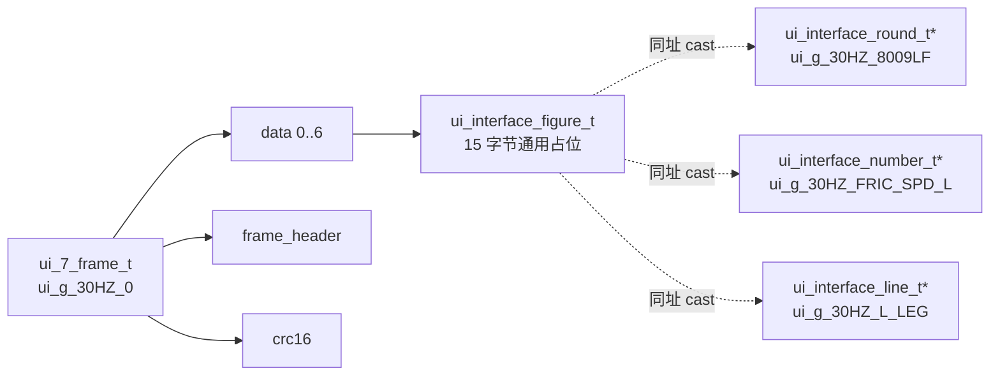
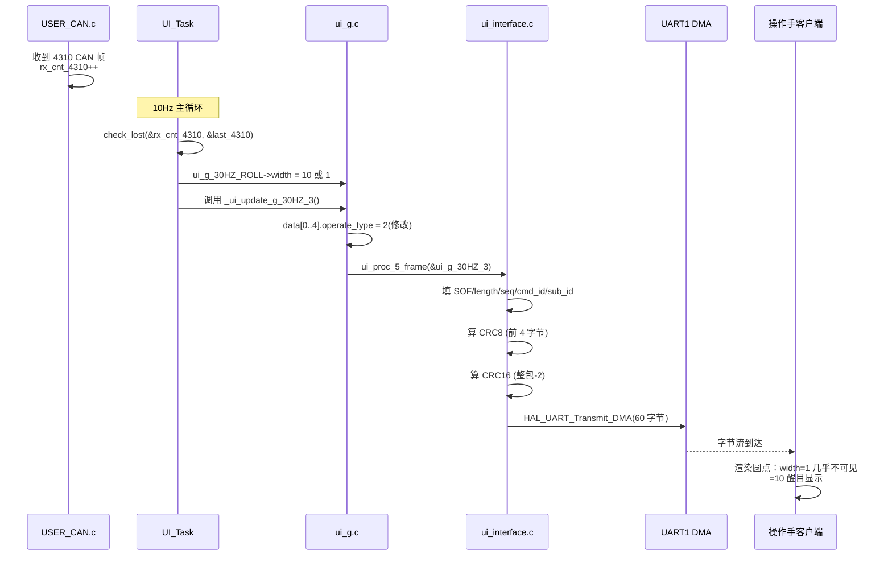
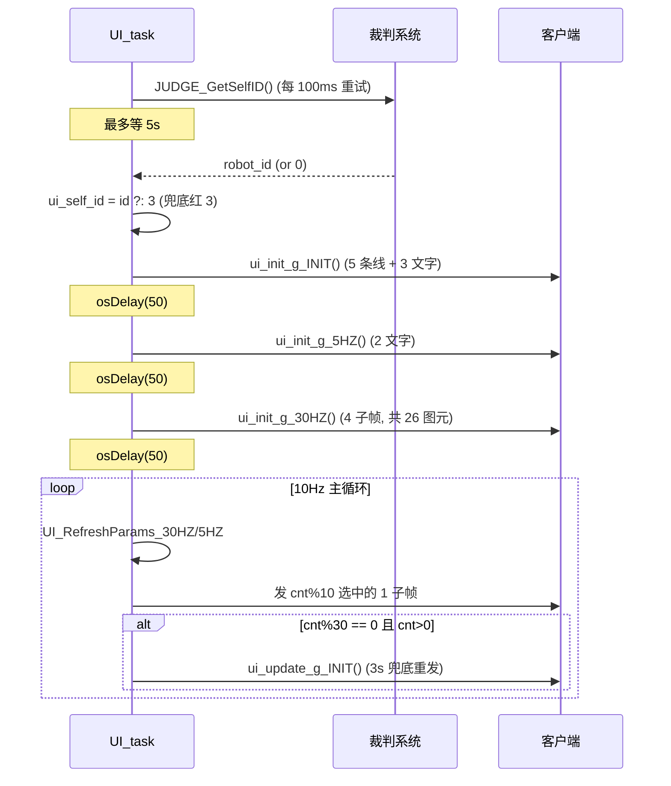
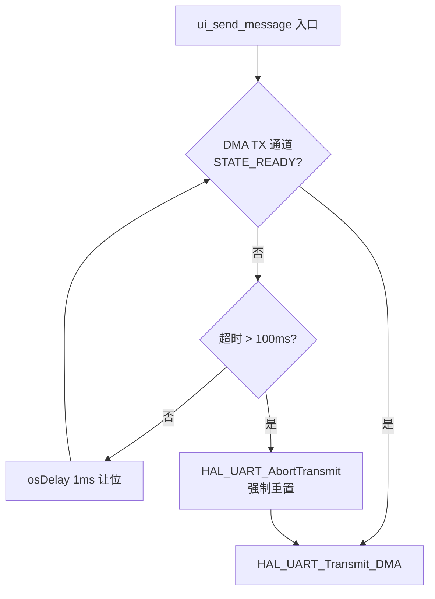

# UI 模块技术文档

> 面向轮腿步兵下板的 RoboMaster 裁判系统"客户端绘图"协议实现。
> 重点说明实现思路与运行时数据流，不重复罗列函数签名（直接看代码注释）。

---

## 1. 模块定位

UI 模块是下板 MCU 与"操作手客户端屏幕"之间的图形管线。它的工作是：

- 把车上分布在 CAN/485/IMU/视觉的实时状态，**翻译**成裁判系统协议帧；
- 通过 **UART1 DMA** 推给裁判系统串口；
- 让操作手在比赛中能看到电机心跳、姿态、模式、转速、弹数等关键信息。

它**不参与控制决策**，只是控制系统的"显示器"。

---

## 2. 分层架构

UI 模块由四层组成，每一层只关心一件事：

```
┌──────────────────────────────────────────────┐
│   业务层  UI_Task.c                          │  把车况映射成图元字段 + 单帧轮询调度
├──────────────────────────────────────────────┤
│   图层层  ui_g.c / ui_g.h                    │  静态布局 + 子帧分组（Designer 生成）
├──────────────────────────────────────────────┤
│   协议层  ui_interface.c / ui_interface.h    │  帧头 / CRC / UART DMA / 看门狗
├──────────────────────────────────────────────┤
│   类型层  ui_types.h                         │  位域 + packed 的协议结构体
└──────────────────────────────────────────────┘
            ↓ UART1 DMA                ↑ 外部依赖
       操作手客户端                motor / VMC / Gimbal / B2B / USER_CAN
```

各层的职责契约：

| 层 | 输入 | 输出 | 关键不变量 |
|---|---|---|---|
| **类型层** | — | 5/15/60 字节固定大小的结构体 | `packed` + 位域，与协议字节序一致 |
| **协议层** | 已填好 `data[]` 的帧缓冲 | UART1 DMA 上的字节流 | CRC8 / CRC16 / SOF / cmd_id 正确 |
| **图层层** | 上层修改的字段 | 三态操作（新增/修改/删除）的帧 | `figure_name` 全局唯一 |
| **业务层** | 全车实时状态 | 改图元指针所指字段 | 每 tick 数据保持最新 |

---

## 3. 核心数据结构关系



**关键点：零拷贝指针别名**

每个图元同时有两个身份：
- 在 `ui_g_XXX.data[i]` 里是 `ui_interface_figure_t` 通用占位；
- 在外部用 `ui_interface_round_t* / line_t* / number_t*` 等指针**指向同一地址**。

业务层改指针字段 = 直接改最终发送缓冲区，无需任何 memcpy。

---

## 4. operate_type 三态语义

协议字段 `operate_type:3` 是图元的生命周期状态机：

```
        ┌─────────────┐
        │   0  空操作  │ ← 槽位未填满时占位
        └─────────────┘
              │
              ▼
        ┌─────────────┐   ui_init_g_*()
        │   1  新增    │ ← 上电时调用一次，让客户端注册图元
        └─────────────┘
              │
              ▼
        ┌─────────────┐   _ui_update_g_*()  (轮询)
   ┌──→ │   2  修改    │ ← 主循环每 tick 改一帧
   │    └─────────────┘
   │          │
   └──────────┘
              │
              ▼
        ┌─────────────┐   _ui_remove_g_*()
        │   3  删除    │ ← 切场景 / 下电（当前未触发）
        └─────────────┘
```

实践中：**字符串图元的"隐藏"不走删除**，而是改 `str_length=0`。这样图元仍在客户端注册表里，下次显示无需重建，避免抖动。

---

## 5. 子帧分组与命名空间

裁判系统协议规定单包最多承载 7 个图元（或 1 个字符串）。所以多图元必须**分装到多个子帧**。

```
分组名     子帧编号  帧类型              figure_name[1..2] 命名空间
───────  ───────  ─────────────────  ────────────────────────────
30HZ     _0       ui_7_frame_t        (0, 0,  0..6)
30HZ     _1       ui_7_frame_t        (0, 0,  7..13)
30HZ     _2       ui_7_frame_t        (0, 0, 14..20)
30HZ     _3       ui_5_frame_t        (0, 0, 21..25)
5HZ      _0       ui_string_frame_t   (0, 1,  0)
5HZ      _1       ui_string_frame_t   (0, 1,  1)
INIT     _0       ui_5_frame_t        (0, 2,  0..4)
INIT     _1       ui_string_frame_t   (0, 2,  5)
INIT     _2       ui_string_frame_t   (0, 2,  6)
INIT     _3       ui_string_frame_t   (0, 2,  7)
```

`figure_name[3]` 的设计哲学：**第 1 字节做"分组前缀"，第 2 字节做"序号"**。
这样全局图元 ID 不重叠，客户端不会把不同图元当成同一个覆盖掉。

---

## 6. 整体数据流

以"4310 Yaw 电机断联指示"为例追踪一条数据：



---

## 7. 调度策略：10Hz 单帧轮询

### 7.1 为什么不批量发？

裁判系统对每台机器人有**两个硬限制**：
- 每秒最多 10 个包（10 pps）
- 每秒最多 3.75 KB

如果每 tick 把全部 4 个 30HZ 子帧 + 2 个 5HZ 子帧一次性发完，启动期就会瞬间超限被裁判系统过滤丢包。

### 7.2 调度表

主循环以 **10Hz** 心跳（`osDelay(100)`），用 `cnt % 10` 把发送窗口分配给 6 个子帧：

```
 tick | cnt%10 | 发送子帧       | 实际刷新率
─────┼────────┼───────────────┼──────────
   0 |   0    | 30HZ_0        | 2 Hz
   1 |   1    | 30HZ_1        | 2 Hz
   2 |   2    | 30HZ_2        | 2 Hz
   3 |   3    | 30HZ_3        | 2 Hz
   4 |   4    | 5HZ_0         | 1 Hz
   5 |   5    | 30HZ_0  ◀ 第二次
   6 |   6    | 30HZ_1
   7 |   7    | 30HZ_2
   8 |   8    | 30HZ_3
   9 |   9    | 5HZ_1         | 1 Hz
```

**关键洞察**：每个 30HZ_x 子帧 1 秒发 2 次；每个 5HZ_x 子帧 1 秒发 1 次。
总包数恰好 10 pps，**贴着上限但绝不超过**。

### 7.3 参数刷新独立于发送

```
每个 tick 都做：
  ├── UI_RefreshParams_30HZ()  ← 改所有 30HZ 图元字段（CPU 便宜）
  ├── UI_RefreshParams_5HZ()   ← 改所有 5HZ 字符串
  └── switch(cnt%10) → 只发选中的那 1 个子帧
```

**为什么参数刷新不等到发送时再做？**

因为 `check_lost()` 必须**周期性调用**才能正确判断断联（它是"上次值 vs 当前值"的对比，间隔越久误判概率越大）。把刷新放在发送之外、每 tick 都跑，保证：
1. 断联检测灵敏（10Hz 采样）；
2. 发出去的字段总是最新的（数据已经准备好，调度只决定发哪一帧）。

---

## 8. 启动时序



为什么三组 init 之间要 `osDelay(50)`？
**给裁判系统串口缓冲区留余量**，避免新增 26 个图元的连续大流量瞬间塞满缓冲触发丢包。

---

## 9. INIT 静态层 3 秒兜底

静态层（装饰线、标签字）的特点：**数据从不变化**。

但裁判系统串口是无确认的单向链路，丢包不可避免。如果只在上电时发一次，遇到通信抖动后这些图元会"永远消失"，操作手屏幕上出现空缺。

**对策**：每 30 个 tick (= 3s) 调用一次 `ui_update_g_INIT()`，把所有 INIT 图元以 `operate_type=2`(修改) 重发。

```
启动 ─── INIT init ─── 主循环 ─── 主循环 ─── ... ─── 主循环 ───
                          │           │                  │
                       cnt=30      cnt=60             cnt=N×30
                          │           │                  │
                       重发        重发              重发  (每 3s)
```

**为什么是 3s 而不是 1s？**
INIT 一次会同时发 1 个 5 图元帧 + 3 个字符串帧 = 4 个包，等于"插队"占用了 4 个 pps 名额。
3s 间隔让平均额外流量 ≈ 1.3 pps，仍远低于 10pps 上限。

---

## 10. 断联检测的两种策略

UI 用了**两套**断联判断逻辑，针对不同帧率的源：

### 10.1 高频源（关节电机、3508、4310）

源帧率 >= 100Hz，10Hz 采样足够灵敏：

```
check_lost(&rx_cnt, &last):
    lost = (*rx_cnt == *last)   // 上次和这次相等 → 100ms 内没新帧 → 断了
    *last = *rx_cnt
    return lost
```

**前提**：UI 任务必须严格 10Hz 调用此函数，否则 last 不更新会误判。

### 10.2 低频源（功率计 10Hz）

源帧率本身只有 10Hz，简单的"上次 vs 当前"必然误判。改成"500ms 内有任何变化就算在线"：

```
if (cur != last):
    last_change_tick = now
lost = (now - last_change_tick >= 500ms)
```

**等效**：用 RTOS tick 给计数器变化打了一个 500ms 的"看门狗喂狗"窗口。

---

## 11. UART DMA 发送看门狗



**两个易踩的坑**：

1. **不能查 `huart1.gState`**：该字段被 RX/TX 共享，TX 完成后状态仍非 READY，会一直空转。
   只查 `HAL_DMA_GetState(huart1.hdmatx)`，看 TX 专属通道。

2. **不能 busy-wait**：UI 任务优先级低，busy-wait 会饿死其他任务。
   `osDelay(1)` 让位给同优先级或高优先级任务。

3. **必须有看门狗**：HAL 状态机偶尔会卡死（DMA 中断丢失），不强制 Abort 会**整路停摆**。100ms 是个保守值，既给正常发送留余量，又快到操作手不会觉得卡。

---

## 12. CRC 与帧封口

帧由"帧头 5B + cmd_id 2B + data 段 N×15B + CRC16 2B"组成：

```
┌─────────┬─────────┬─────┬──────┬────────┬────────┬─────────────────┬────────┐
│ SOF=0xA5│  length │ seq │ CRC8 │ cmd_id │ sub_id │   data 段       │ CRC16  │
│   1B    │   2B    │ 1B  │  1B  │  2B    │  2B    │  15B × N        │  2B    │
└─────────┴─────────┴─────┴──────┴────────┴────────┴─────────────────┴────────┘
         ↑ CRC8 校验前 4 字节 ↑
        ↑ CRC16 校验整包 - 2 (不含末尾自己) ↑
```

`length` 字段含义是"data 段长度"，不是整包长度，所以 = `6 + 15*N`（6 字节包括 sub_id + send_id + recv_id）。

`DEFINE_FRAME_PROC(num, id)` 宏一次生成 4 个变体（1/2/5/7 图元），核心逻辑相同，避免重复代码。

---

## 13. 关键设计权衡

| 设计 | 选择 | 代价 |
|---|---|---|
| 图元缓冲 | 静态全局 + 指针别名 | 牺牲灵活性（图元数固定） |
| 调度 | 单帧轮询 10pps | 单图元刷新率仅 1-2Hz |
| 断联指示 | 复用 width 字段 | 不能再单独调线宽 |
| 字符串显隐 | str_length=0 | 多发一帧但避免抖动 |
| INIT 重发 | 每 3s 全量 | 占用 ~1.3 pps |
| 弧线归一化 | mid 夹到 [20,339] | 朝向接近 0/360 时弧会"贴边" |

---

## 14. 已知 TODO（第二批）

代码里标记的图元含义：

- `ui_g_30HZ_NUC` — NUC/视觉主机心跳
- `ui_g_30HZ_SUPER_CUP` — 超级电容剩余电量条
- `ui_g_30HZ_BUFFER_NUM` — 缓冲能量数字
- `ui_g_30HZ_PITCH` — PITCH 电机心跳
- `ui_g_30HZ_FRIC_L / FRIC_R` — 摩擦轮电机心跳
- `ui_g_30HZ_UNNAME1 / UNNAME2` — 未指派备用槽
- `ui_g_INIT_NewLine ~ NewLine5` — 静态装饰布局微调

接入时只需在 `UI_RefreshParams_30HZ()` 里添加新的字段映射，**无需改动调度逻辑或协议层**。

---

## 15. 文件清单

| 路径 | 角色 |
|---|---|
| [include/ui_types.h](include/ui_types.h) | 协议位域 + packed 结构体 |
| [include/ui_interface.h](include/ui_interface.h) | 协议层对外头 |
| [include/ui.h](include/ui.h) | 业务层统一入口 |
| [include/ui_g.h](include/ui_g.h) | 全部图元指针声明 |
| [source/ui_interface.c](source/ui_interface.c) | UART/DMA + CRC + 帧封口 |
| [source/ui_g.c](source/ui_g.c) | Designer 生成的静态布局 |
| [source/UI_Task.c](source/UI_Task.c) | 主任务 + 参数刷新 + 调度 |

> Judge.{c,h} / Detect.{c,h} / Crc.{c,h} / Graphics.{c,h} / jlui.* 不属于本 UI 模块的"绘图链路"，是裁判系统接收侧、独立模块或图形助手。
