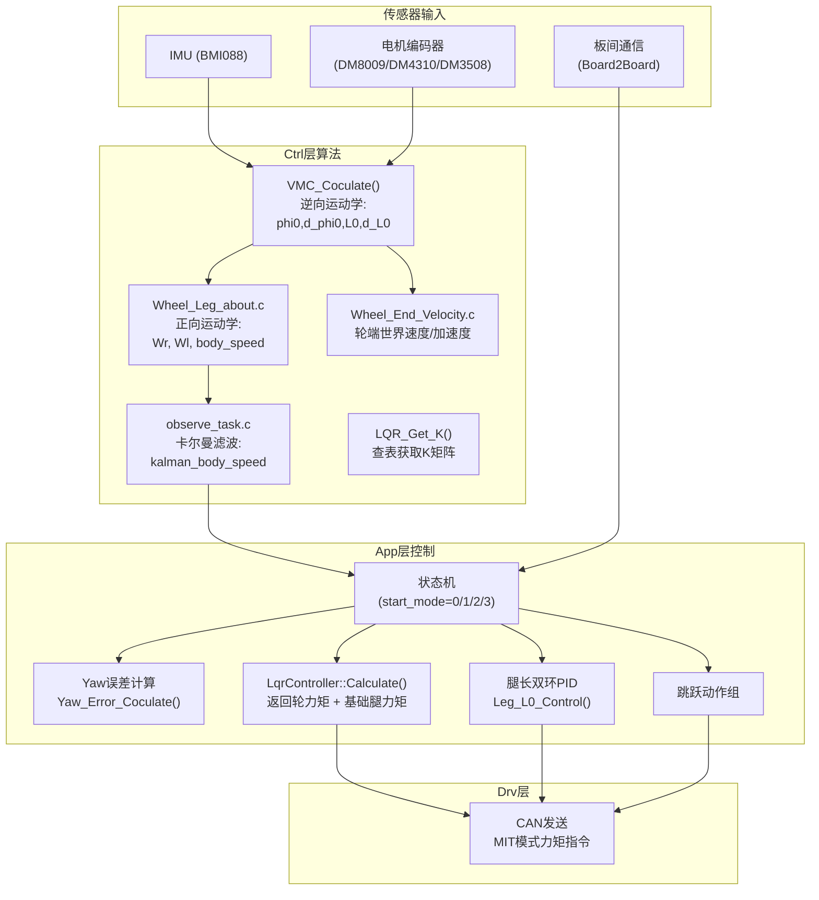
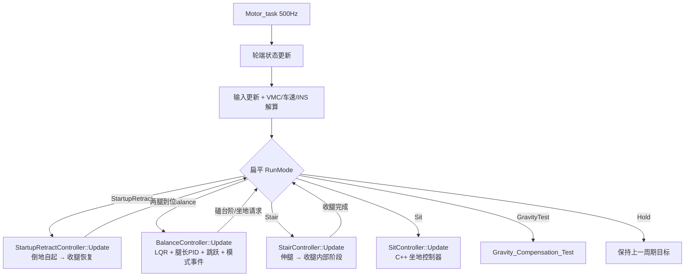
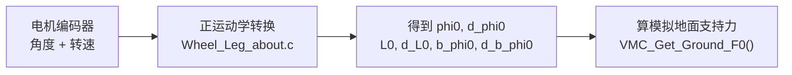
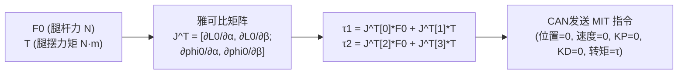
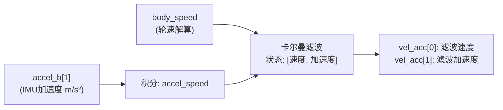
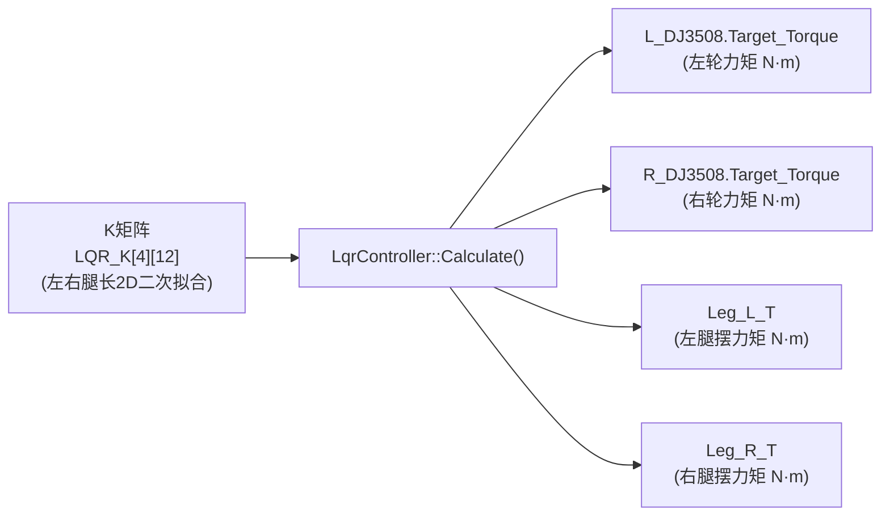
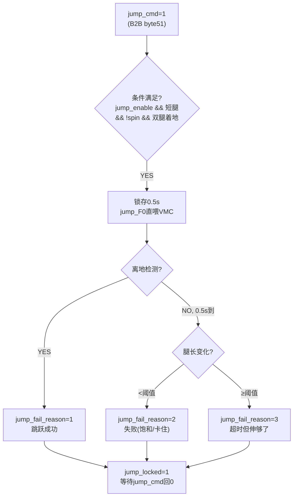

# Motion_Control 运动控制模块文档

> 文件树：`others/Motion_Control/`，包含三层：App（应用层）、Ctrl（算法层）、Drv（驱动层）

---

## 1. 总体架构

```
┌─────────────────────────────────────────────────────────────┐
│                       App 层 (应用层)                        │
│  chassis_behavior_tree(主循环) + 各动作/计算细粒度文件        │
│  Gimbal.c/h   Self_Righting.c/h   User_State.c/h             │
│  行为树调度 / LQR / 跳跃 / 小陀螺 / 上台阶 / 坐地 / 离地检测  │
├─────────────────────────────────────────────────────────────┤
│                       Ctrl 层 (算法层)                        │
│  VMC.c/h  Wheel_Leg_about.c/h  Wheel_End_Velocity.c/h        │
│  observe_task.c/h  user_pid.c/h  Leg_Control.c/h             │
│  Gas_Spring.c/h  kalman_filter1.c/h                          │
│  正向/逆向运动学 / 卡尔曼滤波 / PID库 / LQR矩阵 / 防劈叉      │
├─────────────────────────────────────────────────────────────┤
│                       Drv 层 (驱动层)                         │
│  Motor_Drv.c/h    USER_CAN.c/h                               │
│  DM电机MIT模式 / CAN收发中断 / IMU数据解析                    │
└─────────────────────────────────────────────────────────────┘
```

### 数据流总图



---

## 2. 坐标系与符号约定

### 2.1 机身坐标系（body frame）

| 轴 | 正方向 | 说明 |
|---|---|---|
| X (前) | 机器人前进方向 | `body_speed` 正值 = 前进 |
| Y (左) | 左手定则确定 | 横向速度 |
| Z (上) | 垂直地面向上 | 俯仰轴 |

### 2.2 轮腿极坐标 (VMC 模型)

```
极坐标定义 (每条腿独立):
  r  = L0     — 腿长度 (m)，腿收缩方向为正
  θ  = phi0   — 腿摆角 (rad)，从竖直下垂起算
                 左腿: 前摆为正 (phi0增大=腿向前)
                 右腿: 前摆为正 (同向)
  b_phi0      — VMC等效摆角 (rad)，有偏置
```

**参考零点**:
- `phi0 = 0` : 腿竖直下垂
- `phi0 = PI/2` : 腿水平（站起后的常态）
- `L0 = 0.23m` (LEG_MIN) : 最短腿长
- `L0 = 0.39m` (LEG_MAX) : 最长腿长

### 2.3 云台坐标系 (gimbal frame)

| 参数 | 含义 | 零点 |
|---|---|---|
| `yaw_angle_PI` | 云台Yaw角 (rad) | 与底盘对齐时为0 |
| `head_forward_angle` | 云台物理零点偏置 (rad) | 机头正前方 |

### 2.4 世界坐标系

惯性参考系，用于 `vel_acc[0]` (卡尔曼滤波速度) 和 `body_distance` (累计位移)。

### 2.5 全局关键物理量

| 变量 | 含义 | 单位 | 正方向 |
|---|---|---|---|
| `body_speed` | 水平方向车身速度 | m/s | 前进为正 |
| `kalman_body_speed` | 卡尔曼滤波速度 | m/s | 前进为正 |
| `body_distance` | 车身位移积分 | m | 前进为正 |
| `Wr`, `Wl` | 左右轮世界系线速度 | m/s | 前进为正 |
| `d_yaw` | 车身Yaw角速度 | rad/s | CCW (逆时针) 为正 |
| `d_pitch` | 车身Pitch角速度 | rad/s | 抬头为正 |
| `pitch` | 机身俯仰角 | ° (IMU) | 抬头为正 |
| `roll` | 机身横滚角 | ° (IMU) | 右倾为正 |
| `yaw_angle_PI` | 云台相对Yaw角 | rad | 逆时针为正 |
| `Leg_L_T`, `Leg_R_T` | 腿杆力矩 (T = τ) | N·m | 前摆为正 |

---

## 3. 核心算法流程图

### 3.1 状态机 (Motor_task 主循环)



### 3.2 VMC 逆向运动学 (VMC_Coculate)



### 3.3 VMC 正映射 (VMC_Set_F0_T)



### 3.4 卡尔曼滤波速度估计 (observe_task)



- 状态向量 2 维：`[v, a]`
- 测量向量 2 维：`[轮速解算速度(v), IMU加速度(a)]`
- 周期：`0.002s` (500Hz 积分，但 task 是 2ms delay = 隐式 500/2=250Hz)

### 3.5 LQR 控制器 (Balance 模式下)



LQR 状态（10维）：
```
[ body_distance_error, speed_error, yaw_error, d_yaw,
  VMC_L.b_phi0, VMC_L.d_b_phi0, VMC_R.b_phi0, VMC_R.d_b_phi0,
  pitch_trans[0], d_pitch ]
```

### 3.6 跳跃动作组



---

## 4. 接口清单

### 4.1 App 层对外函数

| 函数 | 文件 | 功能 |
|---|---|---|
| `Motor_task()` | chassis_control_task.cpp | C++ 主控制任务调度器，500Hz |
| `task_Motor_Init()` | chassis_init.c | 电机参数初始化 |
| `task_VMC_Init()` | chassis_init.c | VMC结构体初始化 |
| `task_PID_Init()` | chassis_init.c | PID控制器初始化 |
| `task_Pitch_Coculate()` | chassis_init.c | pitch前后帧计算 |
| `task_Motor_Enable()` | motor_enable.c | DM电机使能 |
| `BalanceController::Update()` | balance_controller.cpp | 固定平衡算法顺序，合成最终命令并返回 Stair/Sit 请求 |
| `LqrController::Calculate()` | lqr_controller.cpp | 更新积分状态并返回左右轮/腿 LQR 力矩 |
| `LqrController::UpdateGainMatrix()` | lqr_controller.cpp | 拥有节流计数，以 100 Hz 二维拟合 K(L0_l,L0_r) |
| `spinning_up()` / `spinning_exit()` | spinning_motion.c | 小陀螺加速 / 退出 |
| `Jump_Motion_Update()` | jump_motion.c | 跳跃状态、腿长 PID 与蜂鸣器更新 |
| `off_ground_detect()` | off_ground_detect.c | 离地检测 |
| `StepHitDetector::Update()` | balance_controller.cpp | 持续更新磕台阶命中、长腿延时与离地冷却；自动触发默认关闭 |
| `Yaw_Error_Coculate()` | yaw_error.c | Yaw误差+速度误差 |
| `turn_ctrl_with_stuck_flip()` | leg_retract_common.c | 收腿转角(卡住反向绕长路) |
| `StartupRetractController::Update()` | startup_retract_controller.cpp | 保留旧倒地自起算法，姿态恢复后返回收腿 ChassisCommand |
| `StairController::Update()` | stair_controller.cpp | 单一 Stair 顶层模式内管理伸腿、收腿和完成等待阶段 |
| `SitController::Update()` | sit_controller.cpp | 读取状态快照并返回坐地 ChassisCommand |
| `Gravity_Compensation_Test_Function()` | gravity_comp_test.c | 重力补偿标定测试 |
| `Body_Speed_Coculate()` | Wheel_Leg_about.c | 车身速度解算 |
| `Distance_Error_Set()` | Wheel_Leg_about.c | 距离误差计算 |
| `Speed_Error_Set()` | Wheel_Leg_about.c | 速度误差计算 |
| `Leg_L0_Control()` | Leg_Control.c | 腿长PID控制 |
| `Roll_Comp()` | Wheel_Leg_about.c | 横滚补偿 |
| `PowerCtrl()` | PowerCtrl.c | 功率门控 |
| `Self_Righting_Step()` | Self_Righting.c | 倒地自复位 |
| `Self_Righting_Reset()` | Self_Righting.c | 自复位复位 |
| `Wheel_End_Velocity()` | Wheel_End_Velocity.c | 轮端世界速度+加速度 |
| `rampInit()` / `rampIterate()` | ramp_generator.c | 通用斜坡发生器 |

### 4.2 Ctrl 层对外函数

| 函数 | 文件 | 功能 |
|---|---|---|
| `VMC_Init()` | VMC.c | VMC初始化 |
| `VMC_Coculate()` | VMC.c | 逆向运动学（编码器→极坐标） |
| `VMC_Set_F0_T()` | VMC.c | 正映射（F0+T→电机力矩） |
| `VMC_Get_Ground_F0()` | VMC.c | 获取地面支持力 |
| `PID_INIT()` | user_pid.c | PID初始化 |
| `PID_coculate()` | user_pid.c | PID计算 |
| `PID_Set_Error()` | user_pid.c | 设置线性误差 |
| `PID_Set_AngleError()` | user_pid.c | 设置角度误差（自动最短路径） |
| `PID_Clear()` | user_pid.c | 清零积分 |
| `PID_Reset_OutLimit()` | user_pid.c | 重置输出限幅 |
| `xvEstimateKF_Init()` | observe_task.c | 卡尔曼滤波器初始化 |
| `xvEstimateKF_Update()` | observe_task.c | 卡尔曼滤波器更新 |
| `Kalman_Filter1_Init()` | kalman_filter1.c | 通用卡尔曼初始化 |
| `Kalman_Filter1_Update()` | kalman_filter1.c | 通用卡尔曼更新 |
| `Gas_Spring_GetForce()` | Gas_Spring.c | 气弹簧等效力的拟合 |
| `RAMP_float()` | observe_task.c | 斜坡函数 |
| `LQR_Get_K()` | Wheel_Leg_about.c | LQR矩阵1D二次拟合查表 |
| `anti_split_is_stuck()` | Leg_Control.c | 防劈叉卡住检测 |
| `leg_turn_stuck_detect()` | Leg_Control.c | 腿角卡住检测 |
| `leg_turn_stuck_reset()` | Leg_Control.c | 清卡住计数器 |
| `leg_turn_speed_control()` | Leg_Control.c | 收腿角速度控制 |
| `AntiSplit_Get_K()` | Leg_Control.c | 防劈叉PID参数1D拟合 |
| `INS_Coculate()` | Wheel_Leg_about.c | 惯性导航解算 |
| `Polar_Get()` | Wheel_Leg_about.c | 极坐标信息获取 |
| `body_distance_count()` | Wheel_Leg_about.c | 位移积分 |
| `Wheel_End_Velocity()` | Wheel_End_Velocity.c | 轮端速度+加速度计算 |

### 4.3 Drv 层对外函数

| 函数 | 文件 | 功能 |
|---|---|---|
| `DM_Joint_Motor_Init()` | Motor_Drv.c | DM电机MIT初始化 |
| `Enable_DM_Motor_MIT()` | Motor_Drv.c | DM电机使能 |
| `DM_Motor_Position_Ctrl()` | Motor_Drv.c | 位置模式MIT指令 |
| `DM_Motor_Speed_Ctrl()` | Motor_Drv.c | 速度模式MIT指令 |
| `CAN_Send_MIT_Msg()` | Motor_Drv.c | CAN MIT消息发送 |
| `CAN_Send_AMT16_Msg()` | Motor_Drv.c | AMT16编码器读取 |
| `CAN1_IMU_Filter()` | USER_CAN.c | CAN1 IMU数据滤波 |
| `CAN2_IMU_Filter()` | USER_CAN.c | CAN2 IMU数据滤波 |

---

## 5. 关键参数与单位

| 参数 | 值 | 单位 | 说明 |
|---|---|---|---|
| WHEEL_RADIUS | 0.061 | m | 轮子半径 |
| wheel_track_R | 0.19242 | m | 半轮距（差速半径） |
| LEG_MIN_LENTH | 0.23 | m | 最短腿长 |
| LEG_MAX_LENTH | 0.39 | m | 最长腿长 |
| motor_HZ | 500 | Hz | 控制频率 |
| 控制周期 dt | 0.002 | s | 2ms |
| speed_limit | 1.3 | m/s | 速度限幅 |
| mg | 30 (60/2) | N | 单腿承担重力 ≈ 3kg |
| jump_F0 | 50 | N | 跳跃虚拟力 |
| Leg_F0_Limit | 500 | N | F0幅值上限 |
| PITCH_OFFSET | -0.10 | rad | 常态pitch偏置 |
| WHEEL_RADIUS | 0.061 | m | 轮子半径 |

---

## 6. 文件树总览

```
others/Motion_Control/
├── App/                                  应用层
│   ├── inc/
│   │   ├── chassis_behavior_tree.h      ★ 底盘聚合公共头（取代 motor.h，所有extern/类型/原型）
│   │   ├── chassis_control_task.hpp      C++ 任务调度器、扁平模式与任务上下文
│   │   ├── chassis_control_types.hpp     C++ 控制器共享的状态快照、模式与命令类型
│   │   ├── balance_controller.hpp       正常平衡流程与磕台阶检测器接口
│   │   ├── lqr_controller.hpp           12 维 LQR 输入/输出、配置与控制器接口
│   │   ├── sit_controller.hpp           坐地控制器接口、依赖与参数
│   │   ├── stair_controller.hpp         上台阶控制器接口、内部阶段与参数
│   │   ├── startup_retract_controller.hpp 倒地自起接管与起立前收腿控制器
│   │   ├── Gimbal.h                     云台控制
│   │   ├── Self_Righting.h              倒地自复位
│   │   └── User_State.h                 用户状态
│   └── src/
│       ├── chassis_control_task.cpp     ★ C++ 主循环：状态更新→模式调度→最终映射
│       ├── chassis_state.c              跨动作共享反馈量/常数/标志/共享PID
│       ├── chassis_init.c               电机/VMC/PID 初始化 + pitch计算
│       ├── motor_enable.c               全部电机使能动作
│       ├── balance_controller.cpp       C++ 正常平衡流程 + 磕台阶检测器
│       ├── lqr_controller.cpp           C++ LQR 力矩输出 + K 矩阵节流拟合
│       ├── spinning_motion.c            小陀螺动作组（加速/退出）
│       ├── jump_motion.c                跳跃状态、腿长 PID 与蜂鸣器更新
│       ├── off_ground_detect.c          离地检测
│       ├── yaw_error.c                  常态Yaw误差计算
│       ├── leg_retract_common.c         收腿转角公共逻辑(卡住反向绕长路)
│       ├── startup_retract_controller.cpp C++ 起立恢复控制器（旧自起接管→收腿）
│       ├── stair_controller.cpp         C++ 上台阶控制器（伸腿→收腿内部阶段）
│       ├── sit_controller.cpp           C++ 坐地控制器（状态输入→命令输出）
│       ├── gravity_comp_test.c          重力补偿标定测试
│       ├── Gimbal.c
│       ├── Self_Righting.c
│       └── User_State.c
├── Ctrl/                                 算法层
│   ├── inc/
│   │   ├── Gas_Spring.h                 气弹簧拟合
│   │   ├── kalman_filter1.h             通用卡尔曼滤波
│   │   ├── Leg_Control.h                腿长/防劈叉/收腿控制
│   │   ├── observe_task.h               速度估计任务
│   │   ├── ramp_generator.h             通用斜坡发生器
│   │   ├── user_pid.h                   用户PID库
│   │   ├── VMC.h                        VMC虚拟模型控制
│   │   ├── Wheel_End_Velocity.h         轮端世界速度
│   │   └── Wheel_Leg_about.h            轮腿运动学 + LQR
│   └── src/
│       ├── Gas_Spring.c
│       ├── kalman_filter1.c
│       ├── Leg_Control.c
│       ├── observe_task.c
│       ├── ramp_generator.c             通用斜坡发生器
│       ├── user_pid.c
│       ├── VMC.c
│       ├── Wheel_End_Velocity.c         ★ 轮端速度加速度
│       └── Wheel_Leg_about.c            ★ 正逆运动学 + LQR拟合
└── Drv/                                  驱动层
    ├── inc/
    │   ├── Motor_Drv.h                  DM电机驱动
    │   └── USER_CAN.h                   CAN通信
    └── src/
        ├── Motor_Drv.c
        └── USER_CAN.c
```

---

## 7. 版本历史

| 日期 | 变更 |
|---|---|
| 2025 | 丛庆：初始代码，pitch_trans/yaw_trans 数组 |
| 2026.05 | 补充跳跃动作组、防劈叉、坐地模式、收腿反向绕长路 |
| 2026.05 | 补充 Wheel_End_Velocity 轮端世界速度计算 |
| 2026.06 | 将 motor.c 按"底盘行为树 + 细粒度动作/计算文件"拆分；motor.h→chassis_behavior_tree.h 聚合头；新增 ramp_generator |
